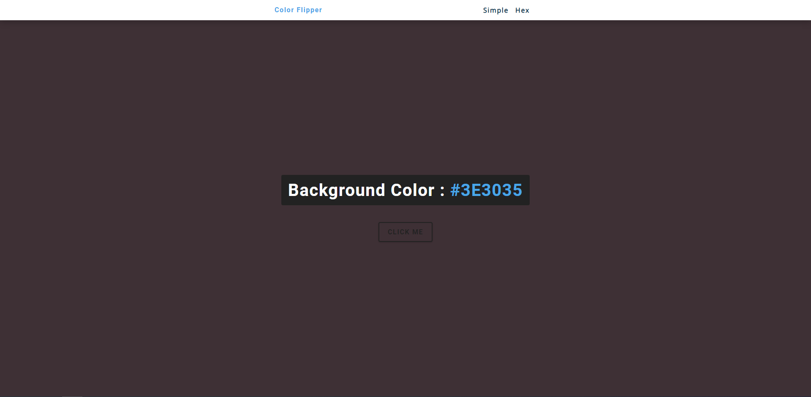

# freeCodeCamp - Color Flipper

[freeCodeCamps](https://www.youtube.com/@freecodecamp) - Vidéo (projet 1) [Build 15 JavaScript Projects - Vanilla JavaScript Course](https://www.youtube.com/watch?v=3PHXvlpOkf4)

## Fonctionnalités

-   Générer des couleurs à partir d'un tableau existant
-   Générer des couleurs aléatoire en Hexadécimal a partir d'un tableau ([0, 1, 2, 3, 4, 5, 6, 7, 8, 9, "A", "B", "C", "D", "E", "F"])

## Rendu

### A l'ouverture de la page

### Au clique pour générer une couleur random du tableau prédéfini

### Dans la page Hex

-   Après avoir cliquer, sa génère un code hexa aléatoire et montre l'apperçu en background\
    
