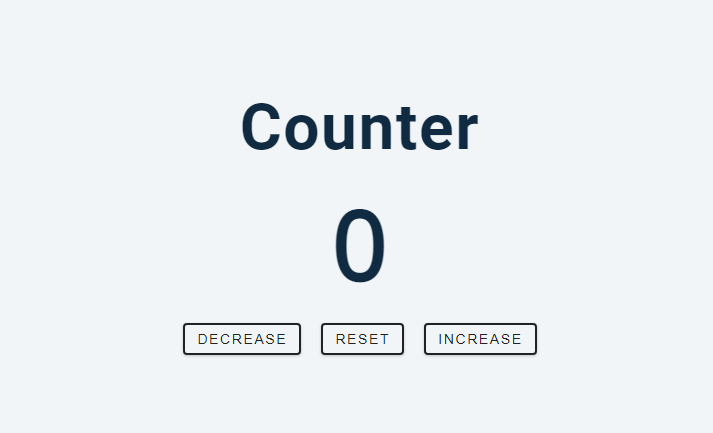
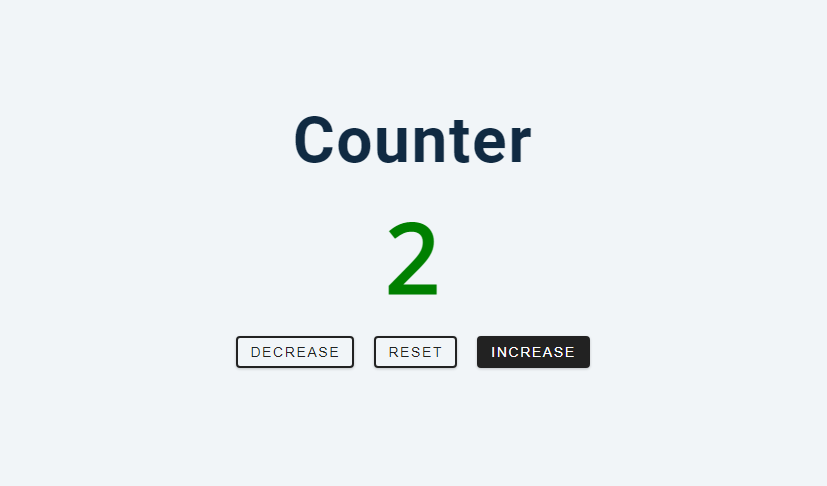
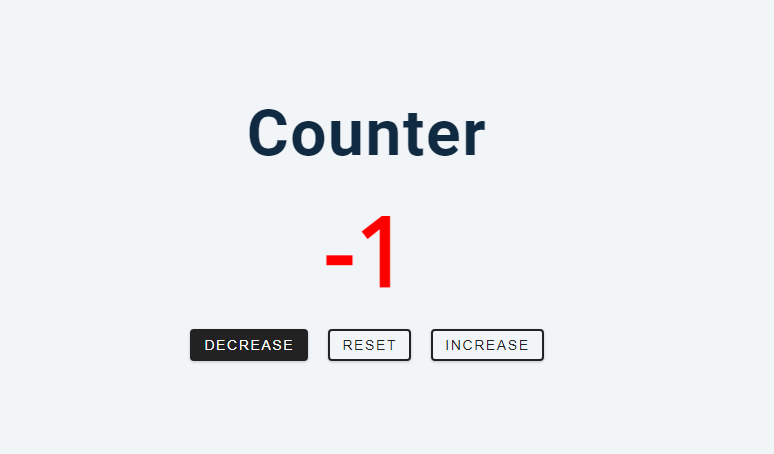
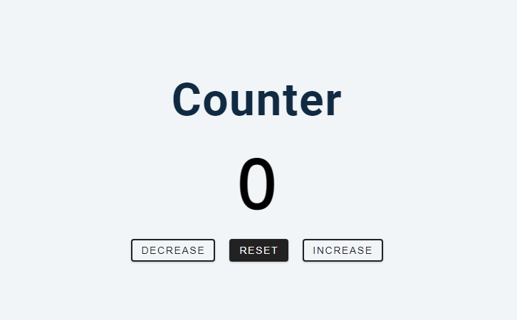

# freeCodeCamp - Counter

[freeCodeCamps](https://www.youtube.com/@freecodecamp) - Vidéo (projet 2) [Build 15 JavaScript Projects - Vanilla JavaScript Course](https://www.youtube.com/watch?v=3PHXvlpOkf4)

## Fonctionnalités

-   Incrémenter le compteur
-   Décrémenter le compteur
-   Reset le compteur
-   Ajuster la couleur en fonction du nombre (si négatif => rouge, positif => vert)

## Rendu

### A l'ouverture de la page

### A l'incrément du compteur

### Au décrément du compteur

### Au reset du compteur

