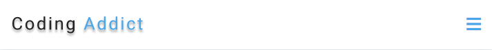
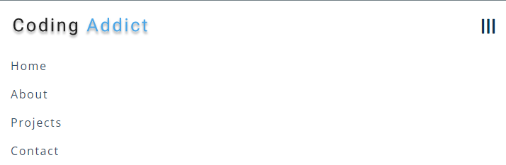

# freeCodeCamp - Navbar

[freeCodeCamps](https://www.youtube.com/@freecodecamp) - Vidéo (projet 4) [Build 15 JavaScript Projects - Vanilla JavaScript Course](https://www.youtube.com/watch?v=3PHXvlpOkf4)

## Fonctionnalités

-   Menu responsive
-   Burger Menu (mobile)

## Rendu

### Navbar version desktop

### Version mobile (menu non ouvert)

### Version mobile (menu ouvert)

