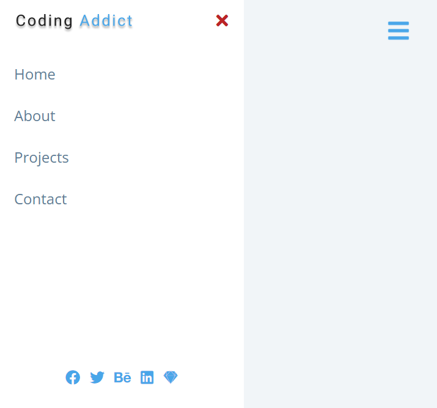
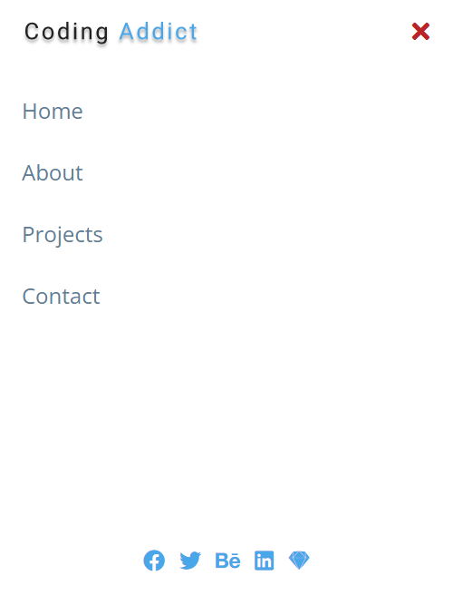

# freeCodeCamp - Sidebar

[freeCodeCamps](https://www.youtube.com/@freecodecamp) - Vidéo (projet 5) [Build 15 JavaScript Projects - Vanilla JavaScript Course](https://www.youtube.com/watch?v=3PHXvlpOkf4)

## Fonctionnalités

-   Menu responsive
-   Burger Menu (mobile)

## Rendu

### Ouverture de la page (burger par defaut)

### Sidebar version desktop

### Sidebar version mobile

