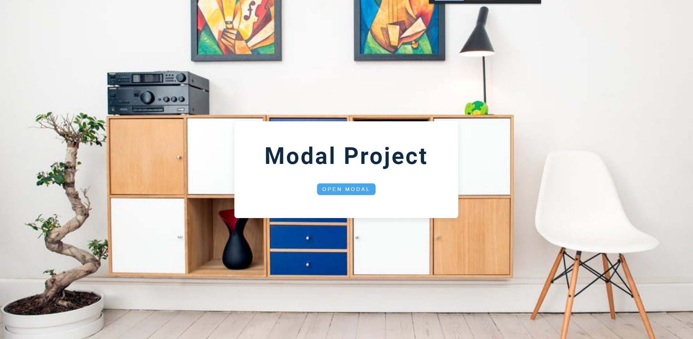
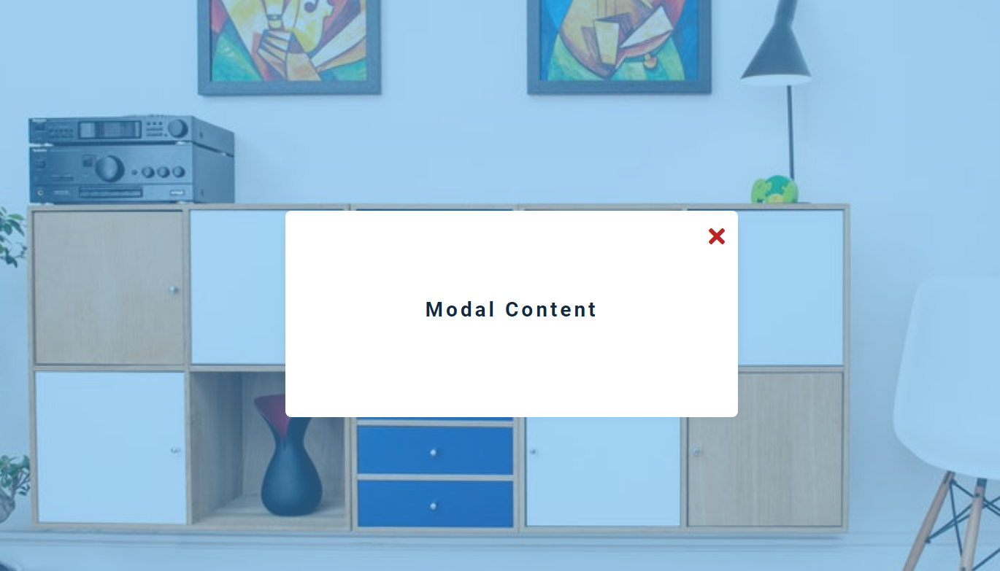

# freeCodeCamp - Modal

Vidéo (projet 6) [Build 15 JavaScript Projects - Vanilla JavaScript Course](https://www.youtube.com/watch?v=3PHXvlpOkf4)

## Fonctionnalités

-   Ouverture d'une modal au clique
-   Fermer la modal au clique du bouton fermer

## Rendu

### Ouverture de la page

### Au clique pour ouvrir le modal

