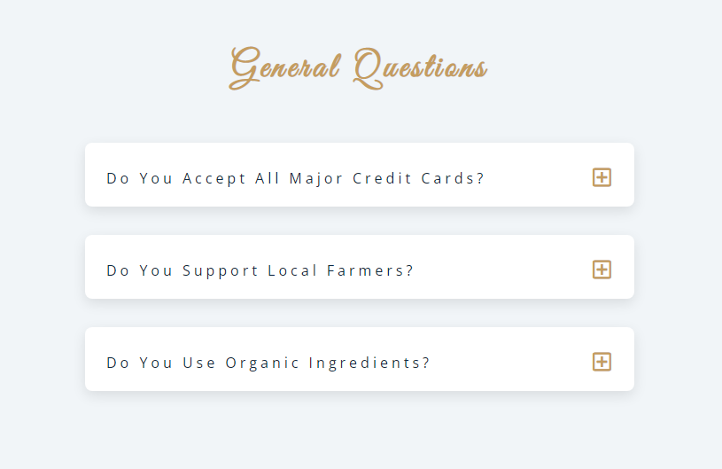
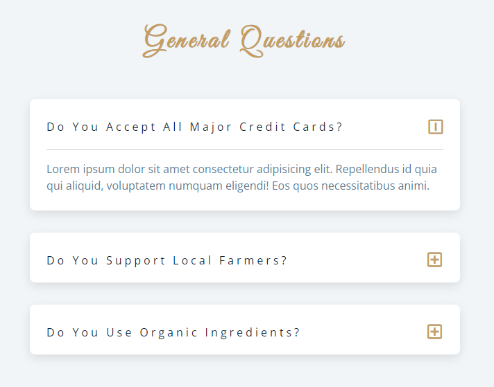
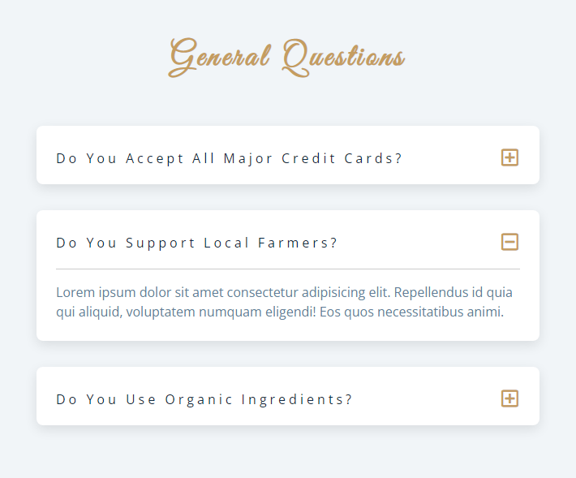

# freeCodeCamp - Accordéon

Vidéo (projet 7) [Build 15 JavaScript Projects - Vanilla JavaScript Course](https://www.youtube.com/watch?v=3PHXvlpOkf4)

## Fonctionnalités

-   Switch entre 2 questions (ouvre le contenu de la question et le ferme si une autre question est ouverte)

## Rendu

### Ouverture de la page

### Au clique de la première question

### Au clique de la deuxième question

