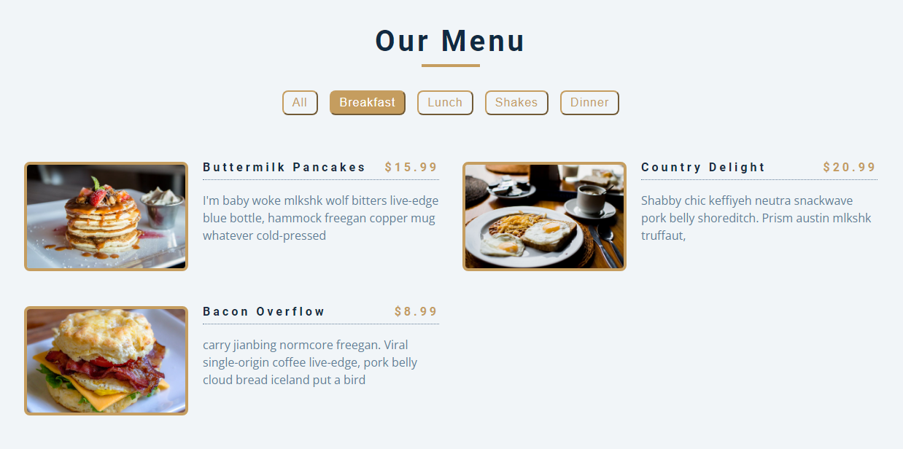
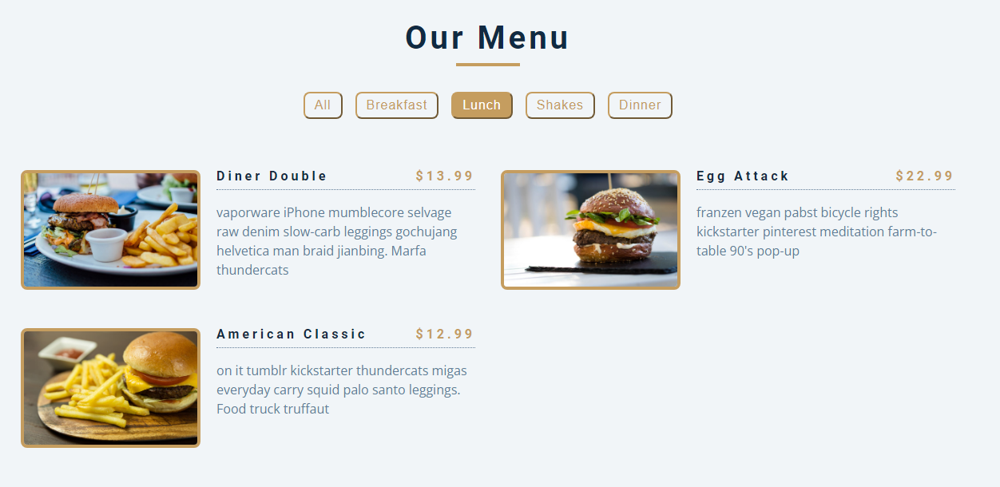

# freeCodeCamp - Menu

Vidéo (projet 8) [Build 15 JavaScript Projects - Vanilla JavaScript Course](https://www.youtube.com/watch?v=3PHXvlpOkf4)

## Fonctionnalités

-   Afficher les menus disponible
-   Trier les menus par catégorie
-   Les catégories sont ajoutés automatiquement si la catégorie du nouveau menu n'existe pas encore dans le tableau
-   Les menus sont listés dans un tableau d'objets
-   La liste des menus sont générés en JS

## Rendu

### Ouverture de la page

### Menus trier par "Breakfast"

### Menus trier par "Lunch"

### Trie par catégorie

Les menus sont trier par la liste de catégorie lister sous forme de menu
