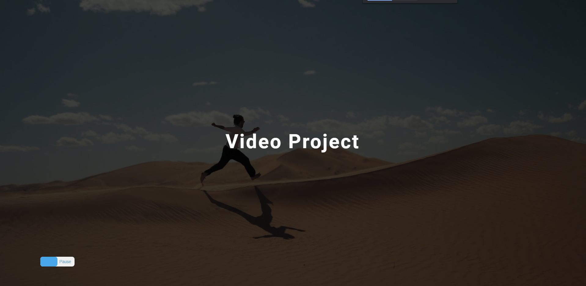
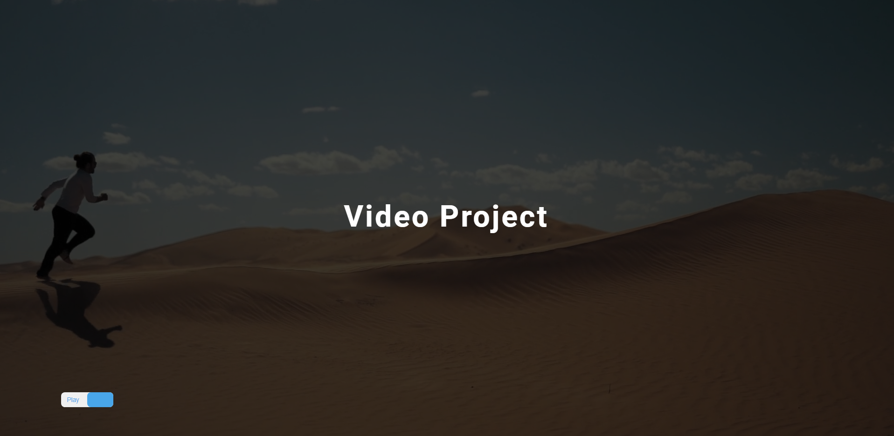

# freeCodeCamp - Video

Vidéo (projet 9) [Build 15 JavaScript Projects - Vanilla JavaScript Course](https://www.youtube.com/watch?v=3PHXvlpOkf4)

## Fonctionnalités

-   Afficher une vidéo en fond
-   Afficher des élements au dessus de la vidéo permettant le controle de la vidéo impossible
-   Possiblité de mettre en pause la vidéo

## Rendu

### Ouverture de la page

### Vidéo en pause

