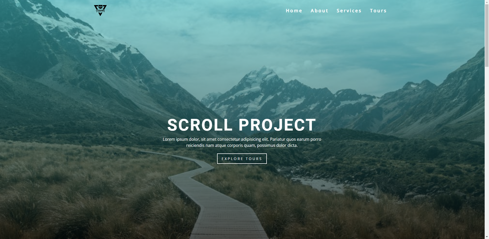
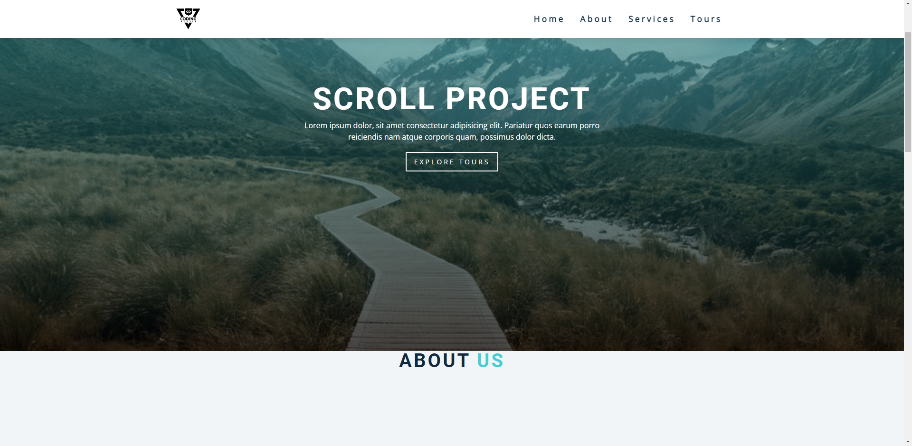
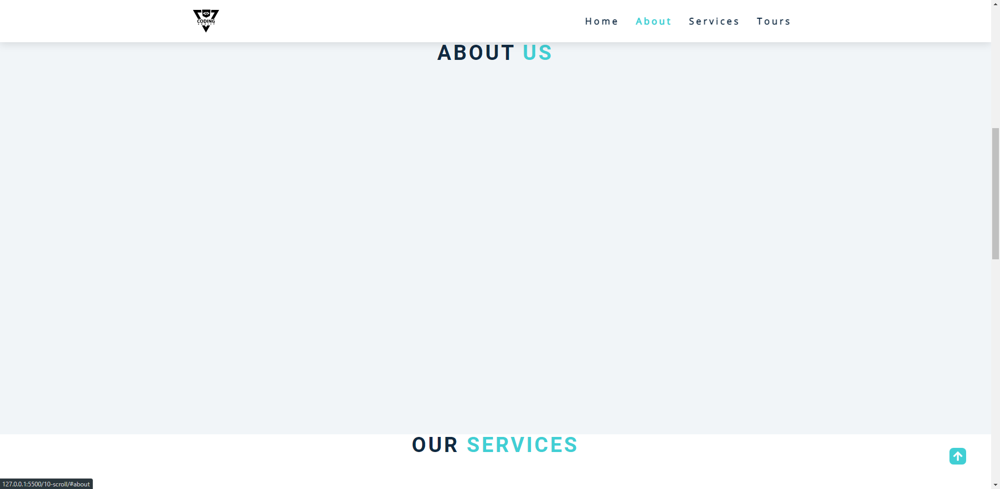
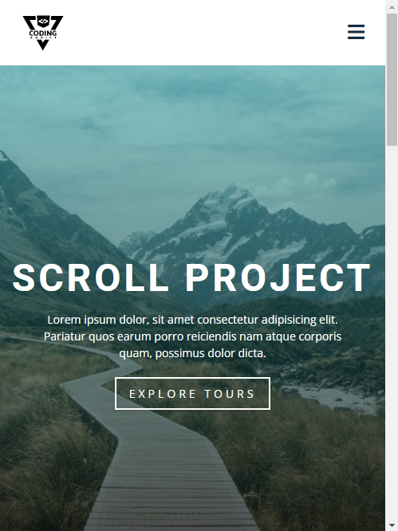

# freeCodeCamp - Scroll

Vidéo (projet 10) [Build 15 JavaScript Projects - Vanilla JavaScript Course](https://www.youtube.com/watch?v=3PHXvlpOkf4)

## Fonctionnalités

-   Page "onepage" réagissant avec le menu selon la section
-   Navbar changeant de position selon le scroll
-   Page responsive
-   Menu burger en version mobile
-   Au clique sur le menu masque le menu et ramène au titre de section (version mobile)
-   Menu burger adaptatif a la taille selon le nombre de liens
-   Ajout d'un bouton permettant de revenir en haut de page (flèche vers le haut)

## Rendu

### Ouverture de la page

### Menu passant en position fixed en scrollant

### Scroll a la section grace au clique

### Menu burger en version mobile

