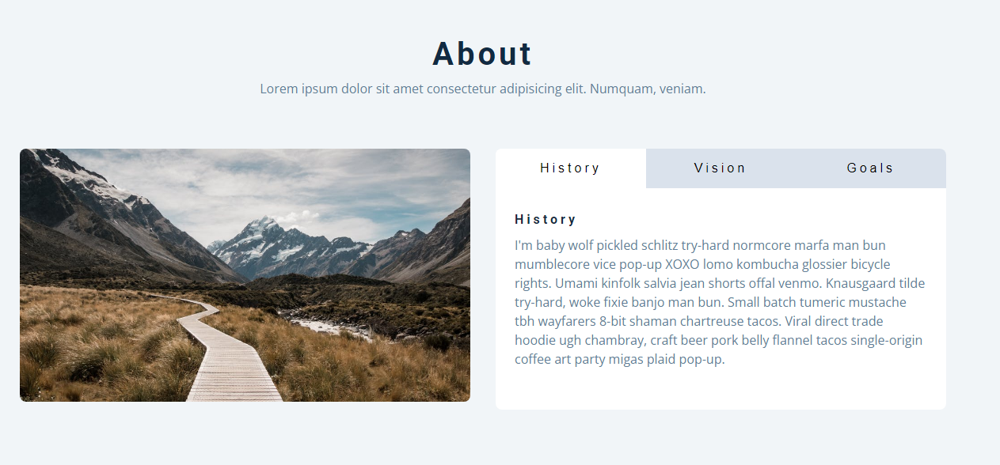

# freeCodeCamp - Tabs

Vidéo (projet 11) [Build 15 JavaScript Projects - Vanilla JavaScript Course](https://www.youtube.com/watch?v=3PHXvlpOkf4)

## Fonctionnalités

-   Afficher le contenu selon l'onglet choisis

## Rendu

### Ouverture de la page

### Contenu de l'onglet "Vision"

### Contenu de l'onglet "Goals"

