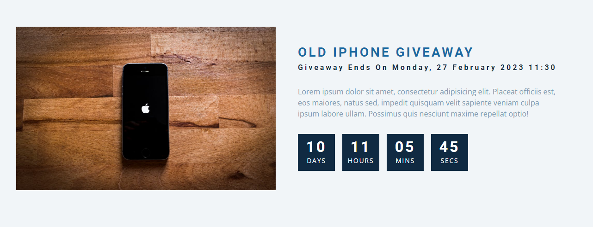

# freeCodeCamp - Countdown Timer

Vidéo (projet 12) [Build 15 JavaScript Projects - Vanilla JavaScript Course](https://www.youtube.com/watch?v=3PHXvlpOkf4)

## Fonctionnalités

-   Possibilité de définir une date précise pour le countdown
-   Compteur mise à jour automatiquement sans rafraichissement de la page
-   Affiche la date a laquelle le compteur se termine

## Rendu

### Ouverture de la page

