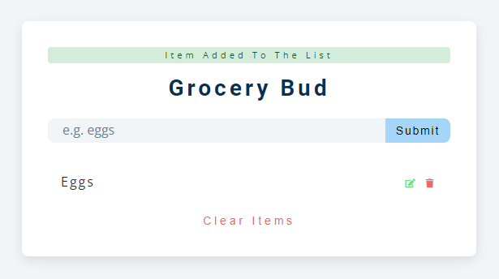

# freeCodeCamp - TodoList

Vidéo (projet 14) [Build 15 JavaScript Projects - Vanilla JavaScript Course](https://www.youtube.com/watch?v=3PHXvlpOkf4)

## Fonctionnalités

-   Possibilité d'ajouter un élément dans la liste
-   Possibilité de modifier cet élement depuis la liste et le mettre à jour
-   Possibilité de supprimer un élément de la liste
-   Possibilité de supprimer toute la liste
-   Ajout d'un message de statut selon l'action (ajouter, supprimer, modifier)
-   (Tout les élements sont enregistrer dans le localStorage)

## Rendu

### Ouverture de la page

### Ajout de l'élement "Eggs" dans la liste

### Modification de l'élement "Eggs" dans la liste

-   Clique sur le boutton pour modifier l'élement: \
-   Validation de la modification en cliquant sur edit (bouton bleu) 

### Suppresion d'un élement de la liste

-   Élément à supprimer (survol):\ 
-   Clique sur le boutton pour supprimer l'élement (et résultat):\ 

### Suppresion de toute la liste

-   Clique du boutton "Clear Items" (avec le résultat):\ 
