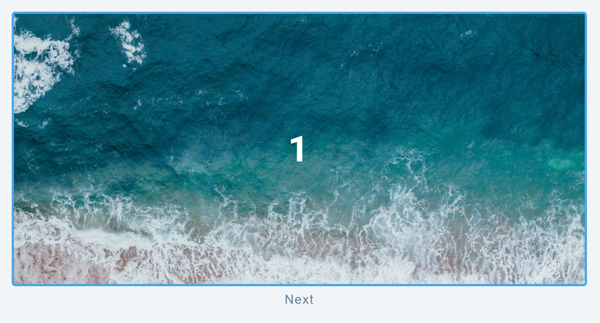
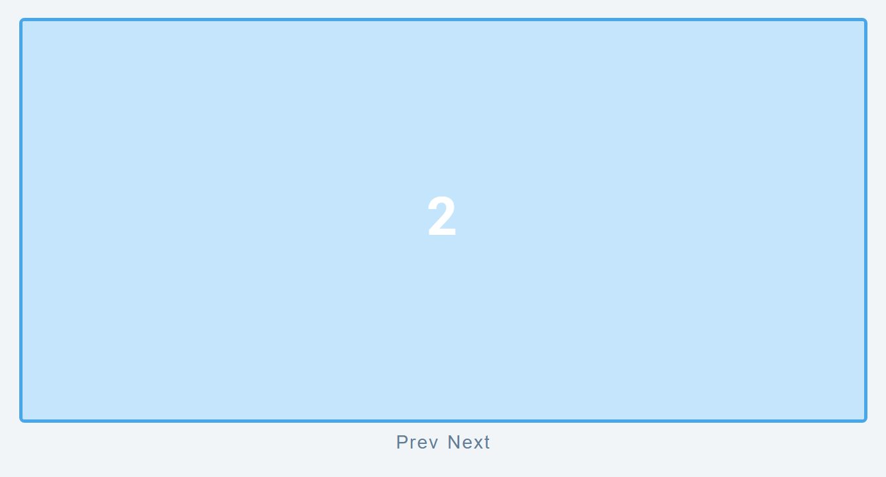
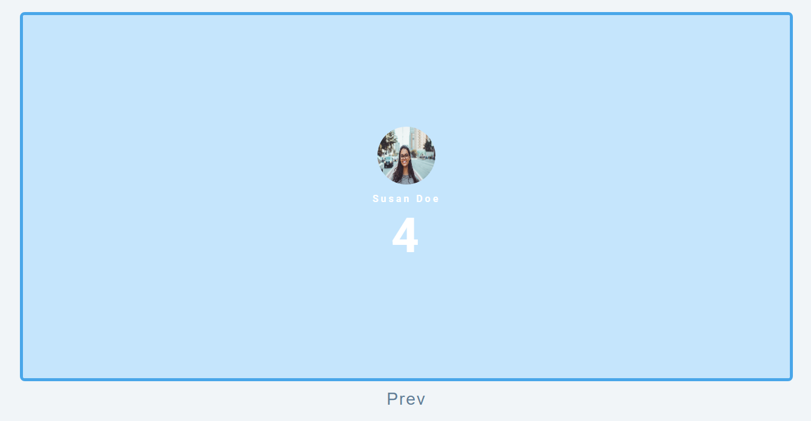

# freeCodeCamp - Slider

Vidéo (projet 15) [Build 15 JavaScript Projects - Vanilla JavaScript Course](https://www.youtube.com/watch?v=3PHXvlpOkf4)

## Fonctionnalités

-   Animation translation des images
-   Boutton "Prev", "Next" afficher selon l'index du tableau des images
-   Contenu afficher sur les images (chiffre pour l'exemple)
-   Si la dernière image est atteinte, ont peu que revenir en arrière avec le boutton "prev"

## Rendu

### Ouverture de la page

### Image suivante

### Dernier slide

